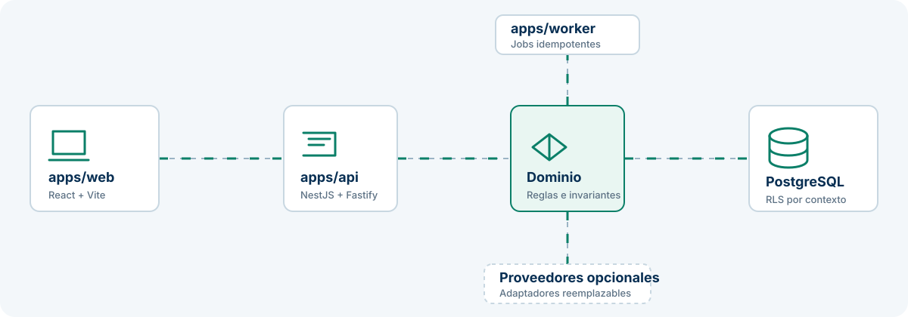
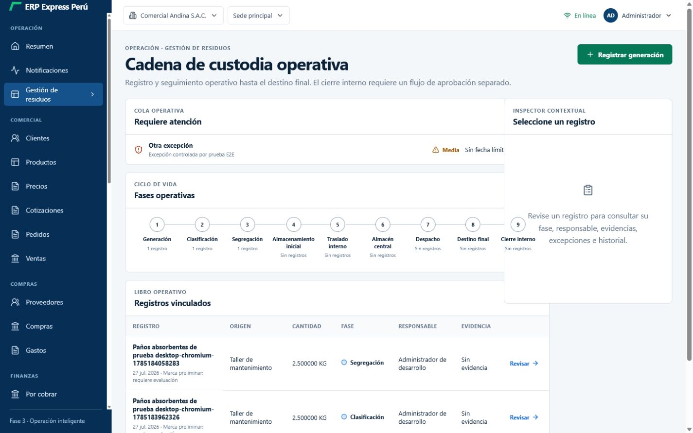
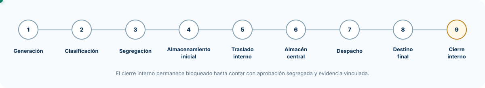
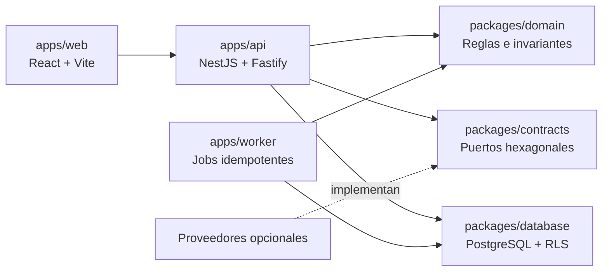

# ERP Express Perú

> Monolito modular portable para gestión empresarial, con trazabilidad,
> seguridad por diseño y operación verificable.

[](https://github.com/oprbguitar/myerpexpressperu/actions/workflows/pages.yml)
[](LICENSE)
[](tsconfig.json)

**[Ver presentación pública](https://oprbguitar.github.io/myerpexpressperu/)** ·
**[Descargar demo portable v0.4.0](https://github.com/oprbguitar/myerpexpressperu/releases/download/v0.4.0/erp-express-peru-demo-v0.4.0.zip)** ·
**[Arquitectura](docs/ARCHITECTURE.md)** ·
**[Gestión de residuos](docs/WASTE-MANAGEMENT.md)** ·
**[Reporte técnico](docs/PHASE-3-REPORT.md)**



## Descarga portable

La edición demostrativa se distribuye como un ZIP autocontenido para Windows,
Linux y macOS. No necesita Node.js ni pnpm: requiere un runtime compatible con
Docker Compose y descarga sus imágenes durante el primer inicio.

### [Descargar ERP Express Perú Demo v0.4.0](https://github.com/oprbguitar/myerpexpressperu/releases/download/v0.4.0/erp-express-peru-demo-v0.4.0.zip)

| Elemento   | Detalle                                                            |
| ---------- | ------------------------------------------------------------------ |
| Paquete    | `erp-express-peru-demo-v0.4.0.zip`                                 |
| Tamaño     | 2 813 135 bytes (2.68 MiB)                                         |
| Integridad | `452c2d7a4e83d5c795f1d0658f520b10c1c9008e5450741d77c51c1fb440a45d` |
| Evidencia  | 282 checksums, 742 componentes SBOM y 812 paquetes inventariados   |
| Datos      | Exclusivamente sintéticos y deterministas                          |
| Entorno    | Demostración local; no apta para producción                        |

Descargue también el
[archivo SHA-256](https://github.com/oprbguitar/myerpexpressperu/releases/download/v0.4.0/erp-express-peru-demo-v0.4.0.zip.sha256)
para comprobar la integridad fuera del ZIP.

Inicio en Windows PowerShell:

```powershell
Expand-Archive .\erp-express-peru-demo-v0.4.0.zip
Set-Location .\erp-express-peru-demo-portable-v0.4.0
.\demo-start.ps1
.\demo-status.ps1
```

Luego abra `http://localhost:18080/demo/`. Consulte la
[guía portable completa](docs/PORTABLE-DEMO.md) y las
[notas técnicas versionadas](docs/releases/v0.4.0.md).

> La descarga es una demostración técnica aislada. No conecte datos reales,
> certificados, API keys ni servicios productivos.



## Visión

ERP Express Perú es una base empresarial portable para pequeñas empresas
peruanas. Reúne operación comercial, administración, CRM, proyectos, recursos
humanos ligero, SST, activos, privacidad, documentos legales y una cadena
operativa de gestión de residuos.

El producto está concebido para que una organización pueda registrar su
operación diaria, conservar trazabilidad y evolucionar por módulos sin convertir
cada capacidad en un servicio aislado. Mantiene una sola unidad de despliegue,
pero separa las reglas de negocio, contratos, adaptadores, persistencia,
presentación y trabajos asíncronos.

El proyecto prioriza:

- límites de dominio explícitos y TypeScript estricto;
- aislamiento por tenant y empresa derivados de la sesión;
- proveedores externos reemplazables y deshabilitados por defecto;
- migraciones transaccionales reversibles y políticas PostgreSQL RLS;
- auditoría, idempotencia, outbox y concurrencia optimista;
- pruebas reproducibles, escaneo de secretos, SBOM y control de licencias.

Ningún proveedor opcional es requisito de arranque. Las capacidades de IA, OCR
y geocodificación permanecen gobernadas y no ejecutan acciones consecuenciales.

## Capacidades implementadas

| Área           | Alcance                                                                                               |
| -------------- | ----------------------------------------------------------------------------------------------------- |
| Comercial      | Clientes, productos, precios, cotizaciones, pedidos, ventas, compras, gastos y pagos                  |
| Administración | Organización, sedes, usuarios, roles, permisos, módulos, archivos y auditoría                         |
| Operación      | CRM, proyectos, RR. HH. ligero, SST, activos y mantenimiento                                          |
| Gobierno       | Privacidad, documentos legales, trazabilidad, outbox y controles de módulo                            |
| Integraciones  | Mapas manuales, OCR asistido e IA gobernada mediante proveedores reemplazables                        |
| Residuos       | Registro, clasificación, segregación, almacenamiento, traslado, despacho, destino final y excepciones |

### Gestión operativa de residuos

El módulo `/residuos` implementa una cadena consecutiva de nueve fases:



Incluye idempotencia, control de concurrencia, auditoría, outbox, RLS y una
interfaz adaptable con inspector contextual. El cierre interno permanece
bloqueado hasta implementar aprobación segregada y evidencia documental
vinculada.

### Recorrido funcional

1. El usuario autenticado registra la generación del residuo dentro de su
   empresa activa.
2. Cada transición valida la fase previa, versión y permisos antes de persistir.
3. Las excepciones operativas quedan visibles en una cola con severidad e
   historial.
4. El inspector contextual reúne fase, responsable, eventos y excepciones sin
   abandonar el libro operativo.
5. El destino final puede registrarse; el cierre interno se rechaza hasta que
   exista un flujo de aprobación separado.

## Arquitectura



| Capa                 | Responsabilidad                                                         |
| -------------------- | ----------------------------------------------------------------------- |
| `apps/web`           | Presentación React, navegación, formularios y borradores revisables     |
| `apps/api`           | Transporte HTTP, sesión, autorización, casos de uso y adaptadores       |
| `apps/worker`        | Jobs idempotentes y procesamiento asíncrono                             |
| `packages/domain`    | Estados, invariantes y transiciones sin dependencias de infraestructura |
| `packages/contracts` | Puertos hexagonales para almacenamiento y proveedores                   |
| `packages/database`  | Migraciones, RLS, semillas y acceso PostgreSQL parametrizado            |
| `packages/security`  | Clasificación, redacción y controles compartidos                        |

- El dominio no importa React, NestJS, PostgreSQL ni proveedores externos.
- El tenant y la empresa provienen exclusivamente de la sesión.
- Las operaciones sensibles se autorizan en API y casos de uso.
- PostgreSQL aplica políticas RLS y restricciones de integridad.
- OCR genera borradores revisables; la IA no ejecuta acciones consecuenciales.

Consulte la [documentación de arquitectura](docs/ARCHITECTURE.md) para conocer
los límites y decisiones técnicas.

## Inicio rápido

### Requisitos

- Node.js 24
- pnpm 10
- Docker y Docker Compose

### Preparación

```powershell
Copy-Item .env.example .env
# Reemplace los secretos locales y defina SEED_ADMIN_EMAIL.
pnpm bootstrap
pnpm dev
```

Servicios locales:

| Servicio | URL                              |
| -------- | -------------------------------- |
| Web      | `http://localhost:5273`          |
| API      | `http://localhost:3100/api/v1`   |
| OpenAPI  | `http://localhost:3100/api/docs` |
| MinIO    | `http://localhost:9001`          |
| Mailpit  | `http://localhost:8025`          |

Para ejecutar el conjunto en contenedores:

```bash
docker compose up --build
```

La web del entorno Docker queda disponible en `http://localhost:8080`.

## Verificación

La contribución completa se valida con:

```bash
pnpm db:migrate
pnpm db:seed
pnpm typecheck
pnpm lint
pnpm test
pnpm test:integration
pnpm test:e2e
pnpm build
pnpm check:bundle
pnpm check:secrets
pnpm phase3:verify
pnpm security:scan
pnpm licenses:check
pnpm sbom:generate
pnpm demo:verify
```

Último cierre técnico registrado:

- 95 pruebas unitarias aprobadas.
- 27 pruebas de integración aprobadas.
- 26 pruebas E2E aprobadas; 10 omisiones son condicionales.
- Auditoría de producción sin vulnerabilidades conocidas.
- Build, secretos, presupuesto de bundle, licencias, SBOM y demo aprobados.

Los resultados, desviaciones y riesgos residuales se conservan en
[docs/PHASE-3-REPORT.md](docs/PHASE-3-REPORT.md).

## Estructura

```text
apps/
  web/       interfaz React y borradores
  api/       transporte, autorización y adaptadores
  worker/    trabajos idempotentes
packages/
  domain/    invariantes y estados
  contracts/ puertos hexagonales
  database/  migraciones, RLS y semillas
  security/  primitivas y controles compartidos
migrations/  cambios transaccionales up/down
modules/     límites y guías funcionales
docs/        arquitectura, operación, calidad y reportes
site/        presentación pública para GitHub Pages
```

## Seguridad y límites

- No se versionan secretos ni credenciales locales.
- Las semillas son sintéticas, deterministas y se rechazan en producción.
- IA, OCR, geocodificación y proveedores externos están deshabilitados por
  defecto.
- No existe conexión productiva directa con SUNAT.
- El seguimiento de residuos es una capacidad operativa interna; no acredita
  cumplimiento ambiental, clasificación legal, SIGERSOL, destino autorizado ni
  cierre regulatorio.

Para reportar una vulnerabilidad, siga
[docs/SECURITY.md](docs/SECURITY.md) y evite divulgar información sensible en
issues públicos.

## Documentación

- [Desarrollo local](docs/LOCAL-DEVELOPMENT.md)
- [Arquitectura](docs/ARCHITECTURE.md)
- [Pruebas](docs/TESTING.md)
- [Gestión operativa de residuos](docs/WASTE-MANAGEMENT.md)
- [Estado del sistema](docs/SYSTEM-STATE-REPORT.md)
- [Reporte profesional de Fase 3](docs/PHASE-3-REPORT.md)
- [Decisiones de dependencias](docs/design-system/dependency-decisions.md)

## Licencia

Distribuido bajo [Mozilla Public License 2.0](LICENSE).
