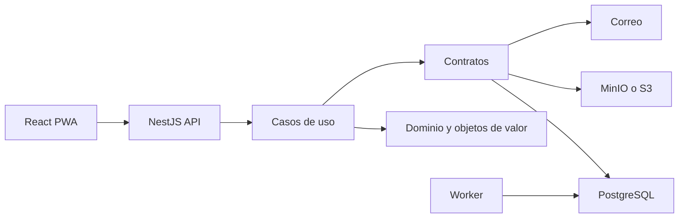

# Arquitectura

ERP Express Perú es un monolito modular: una web React/PWA, una API NestJS/Fastify, un worker y PostgreSQL. Los límites de dominio comparten despliegue, pero se comunican mediante casos de uso, contratos y eventos; el dominio no importa proveedores.

Las capas son presentación (`apps`), aplicación/contratos (`packages`), dominio (`packages/domain`) e infraestructura (`packages/database`, adaptadores en API). Las rutas futuras se cargan dinámicamente y sus paquetes no entran al bundle inicial.
