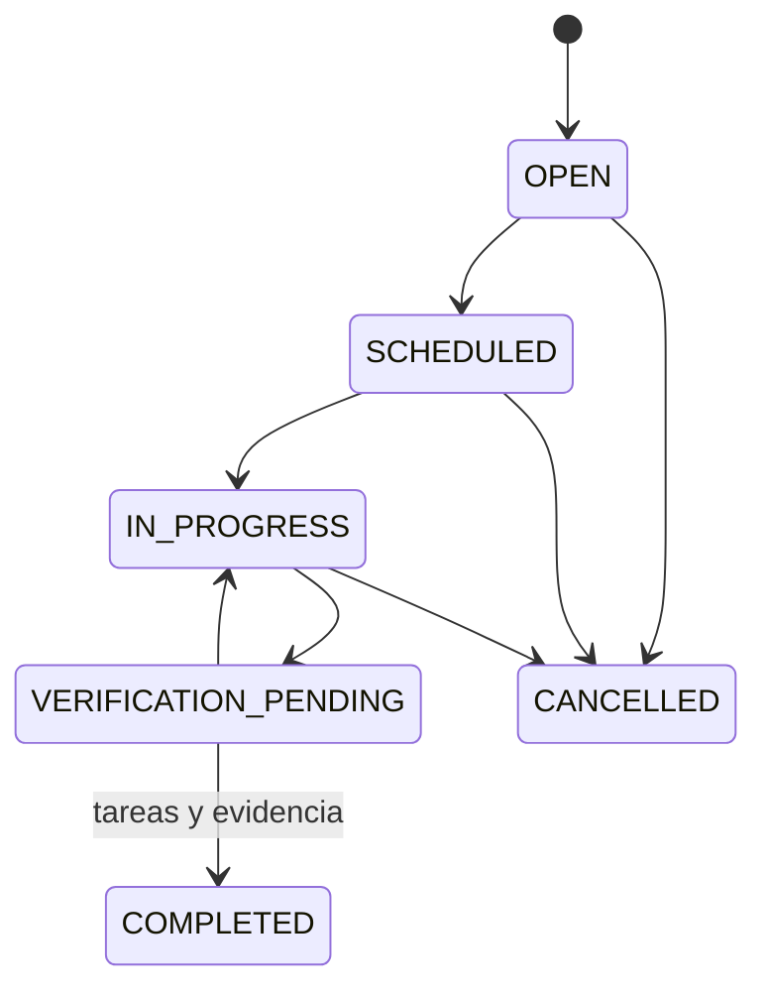

# Activos y mantenimiento — dominio de Fase 3

El dominio puro está en
`packages/domain/src/phase3/assets-maintenance.ts`.

## Reglas implementadas

- Una transferencia requiere asignación activa, origen y destino diferentes.
- La transferencia cierra la asignación anterior y crea otra; no modifica el
  registro histórico recibido.
- Un activo retirado no puede transferirse y su retiro requiere motivo y
  evidencia. El estado retirado se conserva para auditoría.
- Una orden de mantenimiento sólo se completa desde verificación pendiente,
  cuando todas las tareas requeridas están atendidas y existen evidencia,
  verificador y tiempo de indisponibilidad válido.
- Los planes por medidor calculan la siguiente lectura y si el mantenimiento ya
  está vencido.

Las referencias de compra, costos, repuestos y alertas requieren integración
transaccional en aplicación y persistencia. Este alcance no constituye un
módulo de transporte ni implementa depreciación contable.
