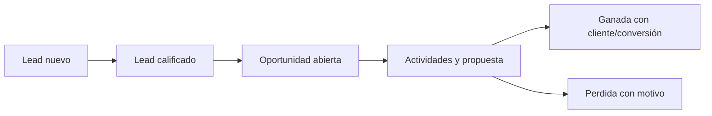

# CRM — dominio de Fase 3

## Alcance implementado

El dominio puro de CRM vive en `packages/domain/src/phase3/crm.ts`. Modela leads,
oportunidades y etapas de pipeline sin dependencias de transporte, persistencia o
proveedores.

Reglas implementadas:

- Un lead sólo pasa de nuevo a calificado y de calificado a convertido.
- Las etapas configurables validan IDs y órdenes únicos, además de probabilidades
  entre 0 y 10 000 puntos básicos.
- Cada cambio de etapa produce el evento auditable
  `crm.opportunity.stage-changed`.
- Una oportunidad ganada referencia un cliente o una conversión de parte.
- Una oportunidad perdida exige un motivo.
- Una probabilidad puede provenir de la etapa o de un ajuste manual explícito.
- Una recomendación de IA no puede adoptar una decisión final.
- Las notas privadas exigen permiso explícito.

La autorización, la auditoría persistente, la conversión a cotización y la
exportación deben aplicarse en sus casos de uso y adaptadores; las funciones de
dominio no sustituyen esos controles.
