# Base de datos

`0001_phase1_core` crea el núcleo. `0002_phase2_operations` añade operación
comercial, `0003_phase2_permission_codes` habilita permisos jerárquicos,
`0004_phase2_history_indexes` endurece historial e índices,
`0005_phase2_append_only_triggers` hace la protección compatible con inserciones
idempotentes y `0006_phase2_remaining_history_triggers` completa caja y eventos
documentales.

Fase 3 agrega cuatro migraciones acotadas y reversibles:

| Migración | Límites |
|---|---|
| `0007_phase3_admin_crm_projects` | Perfiles de negocio, feature flags, configuración versionada/aprobable, CRM, proyectos, tiempo y gastos |
| `0008_phase3_people_sst_assets` | RR. HH. ligero, SST, detalle médico cifrado separado, activos y mantenimiento |
| `0009_phase3_ocr_ai_maps_workflows` | OCR revisable, IA gobernada, mapas y reglas simulables/idempotentes |
| `0010_phase3_governance_providers_demo_observability` | Legal, privacidad, retención, proveedores, demo protegida y observabilidad |
| `0011_phase3_security_hardening` | FKs sensibles ligadas a tenant/empresa y eventos inmutables de revocación/retiro |

Las 124 tablas exigidas por Fase 3 están presentes. Se añadió
`occupational_exam_medical_details` como límite físico adicional: solo admite un
payload `bytea` cifrado y referencia de clave; no existen columnas de diagnóstico
o notas médicas en texto plano.

```mermaid
erDiagram
  TENANTS ||--o{ COMPANIES : contiene
  TENANTS ||--o{ USERS : contiene
  COMPANIES ||--o{ BRANCHES : tiene
  COMPANIES ||--o{ ESTABLISHMENTS : tiene
  COMPANIES ||--o{ ORGANIZATIONAL_AREAS : organiza
  COMPANIES ||--o{ COST_CENTERS : asigna
  USERS ||--o{ USER_COMPANIES : accede
  COMPANIES ||--o{ USER_COMPANIES : autoriza
  USERS ||--o{ USER_ROLES : recibe
  ROLES ||--o{ USER_ROLES : asigna
  ROLES ||--o{ ROLE_PERMISSIONS : contiene
  PERMISSIONS ||--o{ ROLE_PERMISSIONS : define
  COMPANIES ||--o{ COMPANY_MODULES : habilita
  MODULES ||--o{ COMPANY_MODULES : configura
  COMPANIES ||--o{ DOCUMENTS : posee
  COMPANIES ||--o{ AUDIT_EVENTS : registra
  COMPANIES ||--o{ PARTIES : relaciona
  COMPANIES ||--o{ ITEMS : cataloga
  PARTIES ||--o{ QUOTATIONS : solicita
  QUOTATIONS ||--o| SALES_ORDERS : convierte
  PARTIES ||--o{ SALES : compra
  PARTIES ||--o{ PURCHASES : provee
  SALES ||--o| ACCOUNTS_RECEIVABLE : genera
  PURCHASES ||--o| ACCOUNTS_PAYABLE : genera
  PAYMENTS ||--o{ PAYMENT_APPLICATIONS : aplica
  WAREHOUSES ||--o{ STOCK_MOVEMENTS : registra
  SALES ||--o{ COMMERCIAL_DOCUMENTS : emite
  COMPANIES ||--o{ LEADS : capta
  PIPELINES ||--o{ PIPELINE_STAGES : ordena
  PIPELINE_STAGES ||--o{ OPPORTUNITIES : contiene
  COMPANIES ||--o{ PROJECTS : ejecuta
  PROJECTS ||--o{ PROJECT_TASKS : descompone
  COMPANIES ||--o{ EMPLOYEES : vincula
  EMPLOYEES ||--o{ OCCUPATIONAL_EXAMS : programa
  OCCUPATIONAL_EXAMS ||--o| OCCUPATIONAL_EXAM_MEDICAL_DETAILS : protege
  COMPANIES ||--o{ ASSETS : controla
  ASSETS ||--o{ MAINTENANCE_WORK_ORDERS : mantiene
  DOCUMENTS ||--o{ OCR_JOBS : origina
  AI_PROVIDERS ||--o{ AI_INTERACTIONS : procesa
  COMPANIES ||--o{ PRIVACY_REQUESTS : atiende
  PROVIDER_DEFINITIONS ||--o{ PROVIDER_CONFIGURATIONS : configura
```

## Ámbito, RLS y cuenta de runtime

Todas las tablas empresariales de Fase 3 llevan `tenant_id` y `company_id`,
habilitan RLS y comparan ambos valores con `app_tenant_id()` y
`app_company_id()`. La API debe establecerlos mediante `SET LOCAL` dentro de la
misma transacción que ejecuta la consulta.

La cuenta propietaria de tablas omite RLS en PostgreSQL. En producción se debe
usar una cuenta de runtime sin `BYPASSRLS`, sin propiedad de tablas y con los
privilegios mínimos. La prueba temporal de Fase 3 creó un rol no propietario y
confirmó que solo observó 1 de 2 filas de empresas distintas.

Dos repositorios requieren además contexto explícito:

- `occupational_exam_medical_details`: `app.medical_access=true`.
- `provider_configurations`: `app.provider_secret_access=true`.

Estas variables no sustituyen autorización en API; son defensa en profundidad.

## Integridad y concurrencia

- Todos los agregados mutables incorporan `version > 0`. Los repositorios deben
  actualizar con `WHERE id=$1 AND tenant_id=$2 AND company_id=$3 AND version=$4`
  e incrementar `version`; cero filas significa conflicto optimista.
- Aceptaciones, consentimientos, correcciones OCR, llamadas de herramientas IA,
  consumo de proveedor, historia demo, eventos de seguridad y checkpoints de
  auditoría son append-only mediante trigger.
- Una aceptación legal se revoca insertando
  `legal_acceptance_revocations`; un consentimiento se retira insertando
  `consent_withdrawals`. Los campos históricos `revoked_at` y `withdrawn_at`
  quedan obsoletos y no se actualizan.
- `legal_acceptance_effective_status` y `consent_record_effective_status`
  exponen el estado efectivo sin reescribir la evidencia original. Ambas usan
  `security_invoker=true`, por lo que consultan las tablas base con los
  privilegios y RLS del llamador.
- Los estados, montos, fechas, porcentajes y cardinalidades sensibles usan
  `CHECK`; las relaciones principales usan claves foráneas.
- Las colas y vencimientos usan índices parciales. Los tableros CRM/proyecto,
  salud de proveedores, métricas y eventos usan índices compuestos según el
  filtro de ámbito.

## Guardas del reinicio demo

Insertar un `demo_reset_job` exige simultáneamente:

1. `environment_name='demo'` y frase `RESET DEMO DATA`.
2. `app.environment='demo'`.
3. `app.demo_reset_enabled=true`.
4. Perfil demo activo y con `reset_enabled=true`, dentro del mismo
   tenant/empresa.
5. Tenant marcado por código `demo-*`.
6. Fingerprint enviado, registrado en el perfil y
   `app.environment_fingerprint` idénticos.

La base rechaza el job si falla cualquiera. El worker todavía debe revalidar
estas guardas antes de ejecutar cambios.

## Operación

Migrar: `pnpm db:migrate`. Revertir la última: `pnpm db:rollback`. Reiniciar
desarrollo: `pnpm db:reset`. No ejecutar `db:reset` contra una base compartida o
productiva.

El procedimiento probado de respaldo y restauración está en
[`BACKUP-AND-RESTORE.md`](BACKUP-AND-RESTORE.md).
