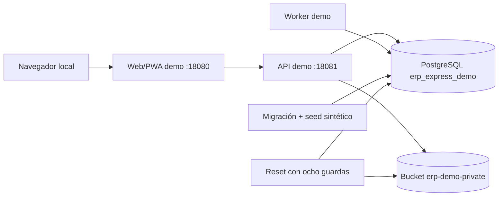
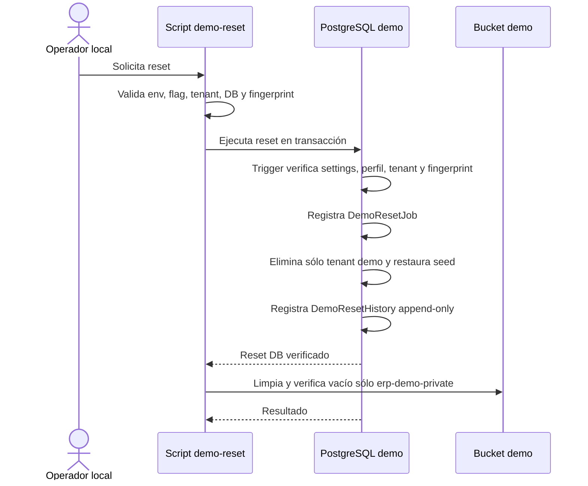

# Entorno de demostración

## Propósito y límites

El perfil `portable-local` es un entorno local separado para evaluación. Utiliza
base, red, volúmenes y bucket Docker con nombres exclusivos de demo. No existe en
este trabajo un despliegue remoto ni una demo pública verificada.

Todos los datos son sintéticos. La aplicación y la página de entrada deben mostrar
`ENTORNO DE DEMOSTRACIÓN · DATOS FICTICIOS`. La demostración no garantiza
cumplimiento legal/tributario, exactitud de proveedores, disponibilidad ni
certificación SUNAT.

## Arquitectura



PostgreSQL no publica puerto al host. Web, API y almacenamiento sólo se enlazan a
`127.0.0.1`. Los providers externos básicos no son necesarios:

| Categoría | Modo demo |
| --- | --- |
| SUNAT/facturación electrónica | `mock` |
| OCR | `mock`, revisión humana |
| IA | deshabilitada |
| Mapas/geocodificación | manual |
| Correo | local deshabilitado |
| Firma digital | deshabilitada |

## Identidad y secretos

El ZIP contiene `.env.demo.example` con siete marcadores `__GENERATED__`. El primer
inicio genera con CSPRNG:

- contraseñas PostgreSQL separadas para administración, runtime y reset;
- secreto de sesión;
- access key y secret key del almacenamiento;
- contraseña de usuarios demo.

El resultado queda únicamente en `.env.demo`. El ensamblador excluye ese archivo,
busca firmas de claves/tokens y genera checksums. No se incluyen certificados,
backups, URLs productivas ni API keys.

## Semilla y escenarios

`packages/database/src/phase3/demo-seed.ts` crea:

- tenant y compañía con UUID reservados y código `demo-erp-express`;
- ocho usuarios/roles ficticios;
- módulos implementados y permisos mínimos por rol;
- semilla comercial existente de Fase 2, marcada como demostración;
- CRM/proyecto/tiempo/gasto para escenario A;
- catálogo/inventario/venta/compra/saldos para escenario B;
- proyecto, trabajador, contrato ficticio, SST, activo y mantenimiento para C;
- `DemoProfile`, tres `DemoScenario` y un `DemoSnapshot` lógico con SHA-256.

No se crean detalles médicos ni datos personales reales.

## Reset



Guardas independientes:

1. entorno `demo`;
2. flag de reset;
3. tenant reservado;
4. prefijo `demo-` persistido;
5. nombre de base dedicado;
6. fingerprint configuración/perfil;
7. perfil activo;
8. trigger de base con settings transaccionales.

El código usa `session_replication_role=replica` sólo dentro de la transacción demo
y con un rol de mantenimiento dedicado, no superusuario y sin `BYPASSRLS`. API y
worker usan otra credencial runtime sujeta a RLS y sin permiso para modificar ese
parámetro. El reset preserva auditoría e historiales legales/privacidad, rechaza un
tenant con más de una empresa, registra fallos durables y verifica referencias
preservadas antes de marcar éxito.

## Operación

Los comandos fuente tienen aliases en el `package.json` raíz:

```text
node scripts/demo/verify-config.mjs
node scripts/demo/check-secrets.mjs
node scripts/demo/generate-sbom.mjs . dist/demo/sbom.cdx.json
node scripts/demo/generate-licenses.mjs . dist/demo/licenses.json
node scripts/demo/build-package.mjs
node scripts/demo/demo-smoke.mjs <directorio> <zip>
```

Los aliases disponibles incluyen `demo:start`, `demo:status`, `demo:health`,
`demo:reset`, `demo:stop`, `demo:verify`, `demo:build`, `demo:smoke`,
`sbom:generate` y `licenses:check`.

## No cubierto

- publicación remota;
- registro público y cuentas temporales;
- scheduler de reset automático;
- rate limiter global;
- notificación externa de fallos;
- homologación de proveedores productivos.

Esos elementos no se presentan como verificados.
