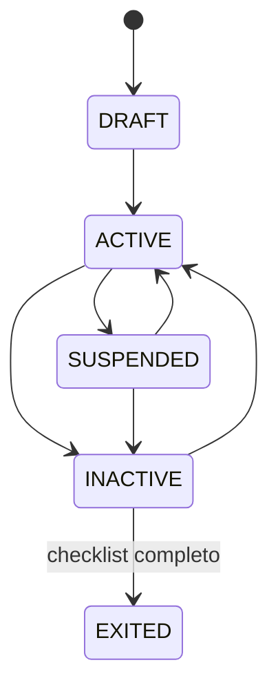

# Recursos humanos — dominio de Fase 3

El alcance es gestión ligera de personas; no implementa cálculo integral de
planilla.

## Límites y reglas

- El empleado referencia una parte comercial, mientras que su usuario del
  sistema es opcional. Ambos conceptos permanecen separados.
- Los cambios de estado producen historial inmutable; desactivar no elimina al
  empleado ni sus contratos.
- Cada cambio contractual crea una versión consecutiva con motivo, fechas
  coherentes y referencia de horario.
- La salida sólo se completa desde el estado inactivo y con la lista de salida
  íntegramente atendida.
- La referencia salarial exige permiso restringido y se omite de exportaciones
  sin ese permiso.
- El modelo general no contiene diagnósticos, resultados clínicos ni historias
  médicas.

El acceso, enmascaramiento y registro de exportaciones se completan en la capa
de aplicación y persistencia.
