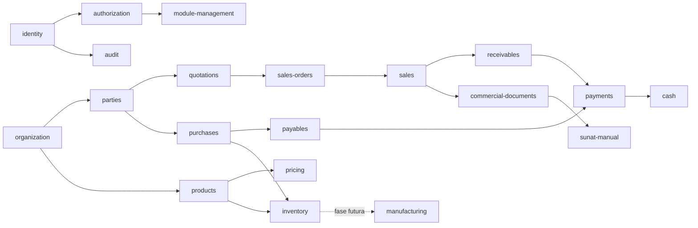

# Sistema de módulos

Cada definición contiene código, versión, dependencias, permisos requeridos, estado
inicial e indicador de implementación. Fase 2 añade los módulos operativos sin
reemplazar organización, identidad, autorización, auditoría ni documentos.

La API impide activar módulos no implementados o con dependencias pendientes. Desactivar preservará registros históricos; el worker consulta solo módulos habilitados.
