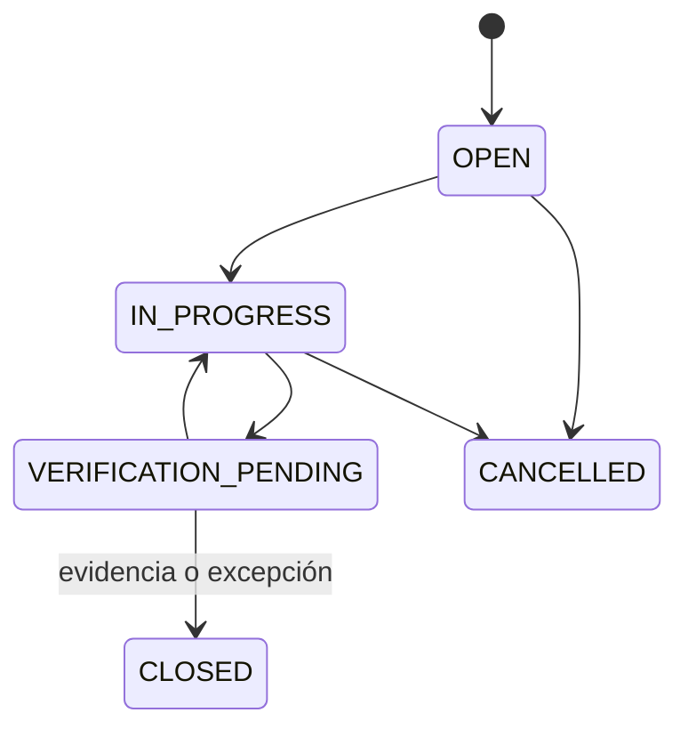

# Seguridad y salud en el trabajo — dominio de Fase 3

El dominio puro SST está en
`packages/domain/src/phase3/occupational-safety.ts`.

## Controles implementados

- La matriz de riesgo calcula probabilidad por consecuencia, con entradas entre
  1 y 5 y niveles bajo, moderado, alto o crítico.
- Las acciones correctivas siguen una máquina de estados y sólo se cierran
  desde verificación pendiente.
- Los incidentes siguen investigación y acciones antes del cierre.
- Todo cierre exige evidencia documental o una excepción documentada, además de
  un verificador.
- La vista general de aptitud contiene únicamente estado, fechas y restricción
  laboral autorizada.
- El detalle médico exige permiso especial, propósito y registro de auditoría.
  Su procesamiento por IA requiere además autorización explícita.

El detalle clínico debe persistirse mediante un repositorio y almacenamiento
privado separados. No forma parte del modelo general de RR. HH., exportaciones
ordinarias ni datos de demostración.
