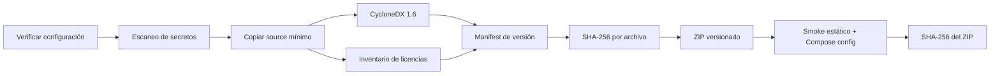

# Paquete portable de demostración

## Artefacto

El ensamblador produce:

```text
dist/demo/erp-express-peru-demo-portable-v0.3.0/
dist/demo/erp-express-peru-demo-v0.3.0.zip
dist/demo/erp-express-peru-demo-v0.3.0.zip.sha256
```

El directorio contiene Compose, configuración sin secretos, scripts Windows y
POSIX, source necesario para construir imágenes, semilla sintética, escenarios,
licencia, avisos, SBOM, inventario de licencias, manifest de versión y checksums.
No incluye `node_modules`, builds previos, `.env`, `.env.demo`, resultados de
pruebas ni datos persistidos.

## Pipeline reproducible



Ejecutar desde la raíz:

```powershell
node scripts/demo/build-package.mjs
```

Para hacer explícito el origen temporal reproducible:

```powershell
$env:SOURCE_DATE_EPOCH = "0"
node scripts/demo/build-package.mjs
```

El ZIP usa entradas sin compresión con orden, timestamp DOS y permisos
deterministas. Esto privilegia trazabilidad y compatibilidad sobre tamaño mínimo.

## Verificación

`demo-smoke.mjs` comprueba:

- presencia de archivos obligatorios;
- ausencia de `.env.demo`;
- SBOM CycloneDX no vacío;
- cada checksum interno;
- existencia del ZIP;
- `docker compose config --quiet` cuando Docker está disponible.

El smoke no levanta servicios por defecto y no interfiere con contenedores o
puertos del usuario. Una prueba de arranque completa debe hacerse en una máquina
limpia antes de distribuir el artefacto.

## Inicio

Después de extraer, sólo se requiere un runtime Docker-compatible:

```powershell
.\demo-start.ps1
.\demo-status.ps1
```

o:

```bash
chmod +x demo-*.sh
./demo-start.sh
./demo-status.sh
```

Consulte el `QUICKSTART.md` incluido. El primer inicio descarga imágenes, construye
web/API/worker, migra, siembra y muestra las credenciales generadas localmente.

## Restricciones de distribución

- No agregar `.env.demo`, volúmenes, backups ni certificados al ZIP.
- No reemplazar providers mock/manual por producción.
- No retirar watermark, disclaimers, licencia, avisos, SBOM o checksums.
- No publicar remotamente sin autorización y una revisión de seguridad/legal.
- No usar el artefacto para procesar datos reales.

## Comandos disponibles

```json
{
  "demo:build": "node scripts/demo/build-package.mjs",
  "demo:verify": "node scripts/demo/verify-config.mjs && node scripts/demo/check-secrets.mjs",
  "demo:smoke": "node scripts/demo/demo-smoke.mjs dist/demo/erp-express-peru-demo-portable-v0.3.0 dist/demo/erp-express-peru-demo-v0.3.0.zip",
  "sbom:generate": "node scripts/demo/generate-sbom.mjs . dist/demo/sbom.cdx.json",
  "licenses:check": "node scripts/demo/generate-licenses.mjs . dist/demo/licenses.json"
}
```

También están disponibles `demo:start`, `demo:status`, `demo:health`,
`demo:reset`, `demo:stop`, `security:scan` y `phase3:verify`.
