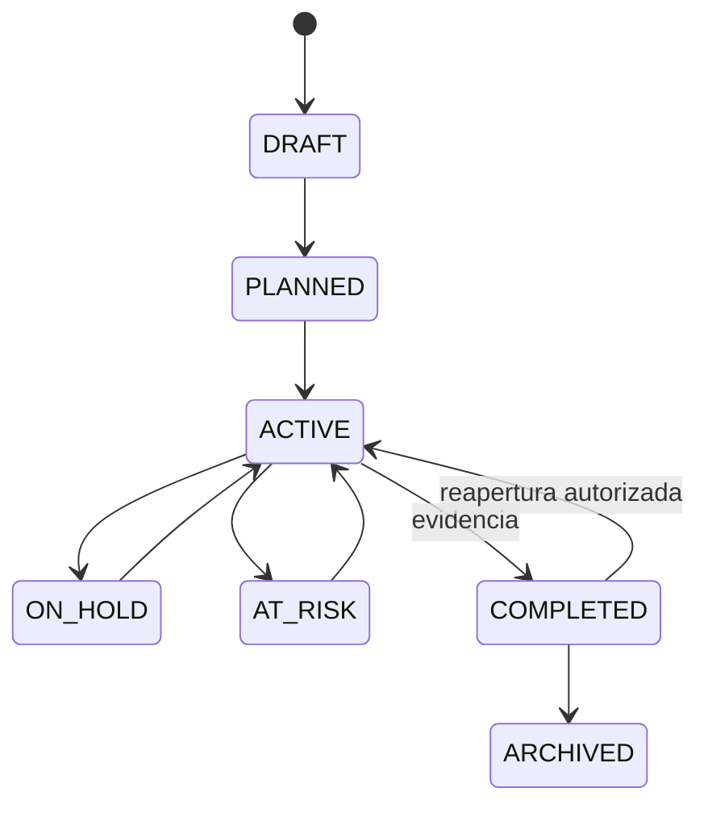

# Proyectos, tiempo y gastos — dominio de Fase 3

El dominio puro está en `packages/domain/src/phase3/projects.ts`.

## Reglas implementadas

- El progreso se calcula desde tareas o hitos ponderados. Los pesos deben sumar
  exactamente 10 000 puntos básicos; no se acepta un porcentaje global aislado.
- El cierre exige evidencia de entregables.
- Un proyecto completado, cancelado o archivado rechaza tiempo y gastos, salvo
  que un caso de uso confirme una reapertura autorizada.
- Cada cambio presupuestal crea una versión consecutiva con motivo y aprobador.
- El tiempo aprobado o contabilizado requiere reversión antes de editarse.
- Un reporte de gastos enviado no puede ser aprobado por quien lo presentó.
- Un cambio de alcance requiere motivo y separación entre solicitante y
  aprobador.

Los importes autoritativos, la rentabilidad, las asociaciones contables y las
actualizaciones transaccionales corresponden a los casos de uso y repositorios.
