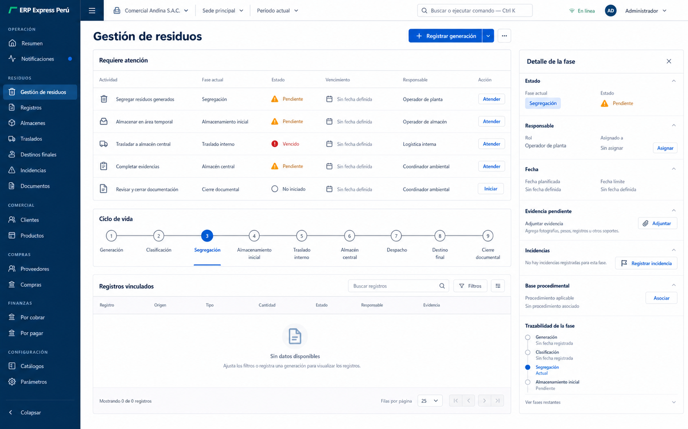

# Especificaciones de pantallas

## Propósito

Este documento traduce la dirección seleccionada, **Cadena de custodia
operativa**, en reglas de composición para escritorio y móvil. Es una
especificación de diseño previa a implementación.

La referencia principal es:

La imagen contiene placeholders y roles estructurales. No prueba que los
módulos, acciones, datos o estados representados existan. La implementación debe
reemplazar cada placeholder con un contrato real o con un estado vacío honesto.

Documentos relacionados:

- [Dirección visual](visual-direction.md);
- [Tokens del sistema de diseño](tokens.md);
- [Inventario y contrato de componentes](component-inventory.md).

## Reglas globales

### Jerarquía

Cada pantalla operativa contiene, como máximo:

1. contexto y título;
2. una acción primaria;
3. superficie principal de decisión;
4. detalle o inspector contextual;
5. información secundaria mediante disclosure progresivo.

No se añaden hero sections, rejillas repetitivas de KPI, cards anidadas ni
paneles para llenar espacio.

### Rejilla y densidad

| Viewport | Estructura |
|---|---|
| 1920 x 1080 | sidebar expandido, contenido fluido, inspector de 360-400 px |
| 1440 x 900 | sidebar expandido o colapsable, contenido principal + inspector de 340-380 px |
| 1366 x 768 | sidebar colapsable, filas compactas opcionales, inspector overlay o 320-340 px |
| 768 x 1024 | navegación drawer, una superficie principal, inspector overlay |
| 390 x 844 | navegación drawer, lista orientada a tarea, detalle full-screen |
| 360 x 800 | una columna, controles táctiles, acción primaria estable |

La densidad predeterminada es `comfortable`. `compact` se permite en tablas y
matrices de escritorio, pero móvil conserva objetivos táctiles mínimos de 44 px
y campos de 48 px cuando sea posible.

### Regiones persistentes

- Skip link al contenido principal.
- Navegación primaria.
- Topbar contextual.
- `main` con un solo `h1`.
- Región de estado para resultados asincrónicos.
- Inspector o drawer con título accesible y cierre explícito.

### Estados obligatorios

Cada superficie de datos define:

- loading;
- empty sin datos;
- empty por filtros;
- success;
- warning;
- error recuperable;
- blocked;
- offline cuando aplique;
- permission denied.

La carga conserva encabezado y contexto. El error no borra un borrador local
seguro. El permiso denegado no revela la existencia de registros fuera del
alcance.

## Shell de aplicación

### Escritorio

- Sidebar objetivo: 216-232 px expandido y 64-72 px colapsado.
- Topbar objetivo: 56-64 px.
- El sidebar agrupa navegación por propósito y muestra solo rutas permitidas.
- El control de colapso mantiene tooltip y nombre accesible.
- Empresa, sede y periodo se muestran antes de búsqueda y usuario.
- El área de comando no desplaza el contexto esencial.
- El estado de conexión usa texto e icono.
- El contenido puede ocupar el ancho disponible; no se fuerza una columna
  central estrecha para tablas operativas.

### Tablet

- Sidebar sustituido por drawer.
- Contexto empresa/sede visible en una línea o en un selector consolidado.
- Inspector como overlay lateral.
- La superficie principal conserva filtros esenciales y una acción primaria.

### Móvil

- Topbar compacta con menú, título corto o contexto y acceso a usuario.
- Empresa, sede y periodo se editan en una vista dedicada.
- La navegación se abre como drawer y restaura foco al cerrar.
- Búsqueda y filtros se abren en pantalla completa o bottom sheet.
- Las acciones de formulario permanecen visibles cuando el flujo lo necesita.
- No hay tablas con scroll horizontal salvo datasets explícitamente justificados.

### Comando y búsqueda

`Ctrl+K` o `Cmd+K`:

- abre un diálogo con nombre accesible;
- conserva la consulta al cambiar de grupo;
- devuelve solo resultados permitidos;
- permite cerrar con `Escape`;
- restaura foco al control de origen;
- no se muestra como función terminada sin índice, API y permisos reales.

## Pantalla 1 - Resumen operativo

### Pregunta que responde

¿Qué requiere atención ahora y en qué fase de la cadena debe actuar el usuario?

### Escritorio

Composición principal:

1. encabezado con contexto, título y acción primaria;
2. cola `Requiere atención`;
3. rail `Ciclo de vida`;
4. registros vinculados;
5. inspector derecho.

La cola precede a cualquier indicador. Cada fila incluye solo información real
necesaria para decidir: actividad, fase, estado, plazo, responsable y acción.
Si uno de esos campos no existe, no se rellena con texto plausible.

El rail presenta las fases verificadas por el dominio. La referencia conceptual
usa:

- generación;
- clasificación;
- segregación;
- almacenamiento inicial;
- traslado interno;
- almacén central;
- despacho;
- destino final;
- cierre documental.

Esta lista es estructural hasta confirmar su correspondencia exacta con estados
y transiciones reales. No debe codificarse como máquina de estados por copiar la
imagen.

### Móvil

Orden:

1. contexto;
2. tareas pendientes;
3. acceso a registro;
4. ciclo vertical resumido;
5. actividad reciente o evidencia cuando exista.

Una tarea abre el detalle a pantalla completa. La acción primaria se ubica cerca
del pulgar. El panorama consolidado queda después de las tareas.

### Interacciones

- Seleccionar tarea activa la fase y abre el inspector.
- Seleccionar fase filtra registros vinculados.
- Seleccionar registro cambia el inspector a detalle de registro.
- Cerrar inspector devuelve foco al elemento seleccionado.
- El historial del navegador conserva ruta y filtros cuando el routing lo
  soporte.

### Estados

- Sin tareas: explicar que no hay acciones dentro del alcance actual, sin
  declarar cumplimiento.
- Sin registros: ofrecer limpiar filtros o iniciar una acción real permitida.
- Error parcial: conservar las regiones cargadas y marcar solo la fuente fallida.
- Offline: mostrar qué información sigue disponible y qué acciones se posponen.

## Pantalla 2 - Espacio del ciclo de vida

### Pregunta que responde

¿Dónde se encuentra cada registro, qué falta para avanzar y qué evidencia
respalda cada transición?

### Escritorio

- Rail de fases sticky bajo el encabezado.
- Tabla o lista central filtrada por fase.
- Inspector con estado, responsable, fechas, evidencia, incidencias y base
  procedimental cuando esos datos existan.
- Un resumen de fase puede mostrar cantidad o pendientes únicamente si incluye
  unidad, periodo, fuente y acceso a registros.

El rail no es un gráfico decorativo. Cada fase es un control con:

- nombre accesible;
- estado textual;
- conteo real opcional;
- selección visible;
- relación con su panel;
- foco y navegación con teclado.

### Móvil

- Lista vertical de fases.
- Disclosure para resumen y pendientes.
- Acceso a registros por fase.
- Inspector a pantalla completa.
- No se comprimen nueve pasos en una fila horizontal.

### Navegación por teclado

- Tab entra y sale del rail.
- Flechas cambian foco entre fases.
- Home y End saltan a extremos.
- Enter o Espacio activa una fase.
- La activación anuncia nombre de fase y cantidad de resultados cuando exista.

## Pantalla 3 - Generación y segregación

### Pregunta que responde

¿Cómo registrar y clasificar correctamente un residuo sin omitir evidencia ni
crear un duplicado?

### Escritorio

- Formulario focal, no dashboard.
- Columna principal para captura.
- Panel contextual para ayuda, valores recientes o evidencia, solo si esas
  funciones existen.
- Dos columnas únicamente para pares cortos y relacionados.
- Resumen final antes de una acción consecuencial.

### Secciones posibles

Las secciones se activan desde contratos reales:

- origen o área generadora;
- fecha y responsable;
- residuo y clasificación;
- cantidad y unidad;
- segregación o contenedor;
- evidencia;
- observaciones;
- resumen y confirmación.

No se inventan catálogos, iconos de materiales, colores de contenedor,
compatibilidades ni advertencias.

### Móvil

- Una columna.
- Selectores con búsqueda en pantalla completa para listas extensas.
- Valores recientes claramente identificados, nunca autoseleccionados sin
  confirmación.
- Evidencia mediante archivo o cámara solo con permisos y flujo implementados.
- Borrador visible y recuperable solo si el almacenamiento local cumple el
  ámbito de usuario y empresa.

### Validación

- Requerido indicado en etiqueta y semántica.
- Error junto al campo y en resumen persistente.
- Foco al primer error después del submit.
- Duplicado potencial muestra criterio y permite revisar antes de continuar.
- Guardado anuncia resultado sin mover foco inesperadamente.

## Pantalla 4 - Registros

### Pregunta que responde

¿Qué registros cumplen los filtros activos y cuál requiere revisión o acción?

### Escritorio

- Toolbar con búsqueda, filtros activos, vista guardada y acción primaria.
- Tabla con encabezado sticky.
- Orden, visibilidad de columnas y densidad solo si están implementados.
- Filas seleccionables sin hacer toda la fila un control ambiguo.
- Acciones por fila en menú con nombre accesible.
- Paginación o virtualización elegida según volumen medido.

Las columnas se declaran por módulo. No se derivan de nombres internos ni
exponen IDs de tenant, empresa, secretos, prompts o objetos protegidos.

### Móvil

Cada registro es una fila o bloque compacto con:

- identificador visible;
- estado textual;
- fecha relevante;
- fase;
- responsable cuando aplique;
- acción principal.

La lista no replica todas las columnas. El detalle abre una vista completa y
preserva filtros al volver.

### Filtros

- Etiqueta visible y valor actual.
- Acción para quitar un filtro.
- Opción `Limpiar filtros`.
- Contador solo si proviene del resultado real.
- Exportación respeta filtros y declara formato y alcance.
- Vistas guardadas no se simulan mediante estado local efímero.

## Pantalla 5 - Detalle y trazabilidad

### Pregunta que responde

¿Cuál es la historia completa del registro y qué evidencia respalda cada evento?

### Escritorio

Encabezado:

- identificador;
- estado;
- contexto;
- acción permitida.

Cuerpo:

- timeline de cadena de custodia;
- resumen de atributos;
- evidencias vinculadas;
- incidencias y acciones correctivas;
- documentos;
- historial de versiones o auditoría.

La timeline es una secuencia única. No se divide en cards desconectadas. Cada
evento expone fecha, responsable, transición y evidencia solo si se encuentran
en la fuente real.

### Móvil

- Encabezado compacto.
- Timeline vertical.
- Disclosure para metadatos secundarios.
- Evidencia con preview segura o descarga autorizada.
- Barra inferior para una acción primaria y una secundaria como máximo.

### Seguridad

- No se muestran URLs permanentes de documentos privados.
- La descarga o preview respeta autorización y expiración.
- El historial no incluye secretos ni payloads sensibles.
- La UI no permite inferir registros de otro tenant o empresa.

## Pantalla 6 - Almacenamiento

### Pregunta que responde

¿Qué zonas y contenedores requieren atención y qué condiciones impiden un
movimiento seguro?

### Escritorio

Se utiliza una matriz estructurada cuando no existe geometría válida. Puede
contener, sujeto a datos reales:

- instalación;
- zona;
- contenedores;
- capacidad;
- compatibilidad;
- condición;
- inspección;
- incidencias.

Una fila abre un inspector de zona. Capacidad usa valor, unidad y representación
lineal; no gauge. Compatibilidad usa texto, icono o patrón además del color.

### Móvil

- Selector de instalación y zona.
- Lista de tareas o zonas.
- Detalle de zona a pantalla completa.
- Movimientos guiados en flujo vertical.

### Límite

No se crea mapa, plano, heat map ni posición física sin datos de layout o
geometría válidos. La matriz no asigna compatibilidades ni capacidades por
suposición.

## Pantalla 7 - Cumplimiento y legal

### Pregunta que responde

¿Qué obligación o control aplica, cuál es su fuente y qué evidencia demuestra su
tratamiento?

### Escritorio

- Matriz legal buscable.
- Filtros por tipo y estado cuando existan.
- Split view para fuente, obligación, control interno y evidencia.
- Fecha de consulta y advertencia de vigencia visibles.

Debe distinguir explícitamente:

- requisito legal obligatorio;
- requisito condicional;
- estándar técnico;
- requisito contractual;
- control interno;
- práctica recomendada.

### Móvil

- Lista por título y tipo.
- Detalle a pantalla completa.
- Fuente oficial como enlace identificable.
- Evidencias y controles después de la obligación.

### Copy legal

No se parafrasea una obligación como certeza si el texto fuente es condicional.
No se declara cumplimiento automático. Toda cita conserva fuente oficial y
fecha de consulta verificadas.

## Pantalla 8 - Centro de documentos y evidencia

### Pregunta que responde

¿Qué documento o evidencia falta, a qué registro pertenece y cuál es su estado
de revisión o vigencia?

### Escritorio

- Cola o tabla de documentos.
- Preview en split view.
- Metadatos y asociaciones.
- Historial de versión.
- Alertas de ausencia, duplicado o vencimiento solo con reglas reales.

### Móvil

- Lista por tarea.
- Upload o captura a pantalla completa.
- Preview segura.
- Confirmación de asociación antes de guardar.

### Upload

- Tipo MIME y extensión validados en cliente y servidor.
- Tamaño máximo visible.
- Progreso real.
- Cancelación y reintento seguros.
- Error conserva metadatos ingresados.
- Drag-and-drop tiene alternativa de teclado.
- OCR produce borrador revisable, nunca confirmación automática.

## Pantalla 9 - Excepciones y acciones correctivas

### Pregunta que responde

¿Qué excepción bloquea o pone en riesgo el flujo, quién debe actuar y cómo se
verifica el cierre?

### Escritorio

- Lista o tabla priorizada a la izquierda.
- Inspector de excepción a la derecha.
- Severidad, estado y plazo como texto más icono.
- Evidencia junto a la descripción.
- Acción inmediata separada de acción correctiva.
- Cierre y verificación como pasos distintos cuando la regla lo requiera.

### Móvil

- Lista por severidad y plazo.
- Detalle full-screen.
- Acción principal estable.
- Evidencia y trazabilidad antes del cierre.

### Estados

- Nueva.
- En atención.
- Bloqueada.
- Pendiente de verificación.
- Cerrada.

Estos nombres son roles de diseño, no enumeraciones de dominio aprobadas. Deben
mapearse o reemplazarse con estados reales antes de implementación.

## Inspectores, drawers y modales

### Inspector contextual

- Ancho de 340-400 px en escritorio.
- Overlay lateral en laptop o tablet cuando falte espacio.
- Pantalla completa en móvil.
- Título, cierre, scroll interno y acciones persistentes.
- Mantiene la selección en la superficie principal.
- Cerrar restaura foco.

### Drawer de formulario

Se usa para alta o edición corta que preserve contexto. Un flujo largo o
consecuencial usa ruta dedicada.

### Modal

Se reserva para confirmaciones, decisiones breves y bloqueantes. No se usa para
consultar detalle extenso, completar formularios largos ni navegar una cadena de
custodia.

## Tablas, listas y matrices

### Tabla operativa

- `caption` o nombre accesible.
- Encabezados con `scope`.
- Sorting anunciado.
- Selección independiente de navegación.
- Estado vacío dentro de la región de tabla.
- Columnas fijadas sin ocultar foco.
- Scroll horizontal solo en escritorio y con señal visible.

### Lista móvil

- Orden de lectura igual al orden visual.
- Acción principal identificable.
- Estado no comunicado solo por color.
- Objetivo táctil mínimo.
- No se convierte cada dato secundario en badge.

### Matriz

- Encabezados de fila y columna.
- Patrón, texto o icono adicional al color.
- Descripción accesible equivalente.
- Navegación por teclado cuando las celdas sean interactivas.

## Formularios

### Anatomía

1. título y propósito;
2. estado de borrador;
3. resumen de errores;
4. secciones lógicas;
5. ayuda contextual;
6. resumen de confirmación;
7. acciones.

### Estados del control

- default;
- hover;
- focus-visible;
- active;
- selected;
- disabled;
- loading;
- invalid;
- success;
- warning.

Success y warning incluyen texto; no se expresan cambiando únicamente el borde.

### Acciones

- Una acción primaria por región.
- Cancelar no destruye un borrador sin aviso.
- Submit se protege contra doble envío.
- Loading conserva etiqueta o explica la acción en curso.
- Una acción irreversible requiere confirmación y, cuando aplique, reautenticación
  o aprobación.

## Visualizaciones

Una visualización se incorpora solo para responder una pregunta definida y con
datos reales.

Preferencias:

- rail o timeline para trazabilidad;
- matriz para segregación o almacenamiento;
- barras para composición o capacidad;
- tendencia para cambio temporal;
- tabla para comparación precisa;
- flujo origen-destino solo cuando existan relaciones suficientes.

Cada visualización incluye título descriptivo, periodo, unidad, fuente, filtros,
descripción accesible, tooltip, drill-down, estados async y acceso a registros
cuando sea útil.

No se usan gráficos 3D, gauges sin objetivo, pies decorativos ni animación que
distorsione datos.

## Accesibilidad

### Teclado y foco

- Todos los controles son alcanzables.
- Focus visible con contraste suficiente.
- Orden de foco sigue la tarea.
- Drawers y diálogos contienen foco solo mientras están abiertos.
- Cierre restaura foco.
- Acciones sticky no duplican controles en el árbol accesible.

### Lectores de pantalla

- Landmarks y encabezados jerárquicos.
- Labels y descripciones asociadas.
- Errores anunciados y vinculados al campo.
- Cambios de estado anunciados sin interrumpir lectura innecesariamente.
- Tablas y matrices con relaciones de encabezado.
- Timeline con lista ordenada y nombres de evento.

### Reflow y zoom

- 200 por ciento de zoom sin pérdida de contenido o acción.
- Sin scroll en dos dimensiones para lectura ordinaria.
- Texto no queda cortado por alturas fijas.
- Inspector y barra inferior no ocultan el contenido enfocado.

### Movimiento

- Transiciones de 160-240 ms para selección e inspector.
- Sin animaciones de entrada para filas rutinarias.
- Reduced motion elimina traslaciones y conserva cambios instantáneos.

## Rendimiento

- Mantener iconografía en una sola librería.
- Cargar mapas, OCR, IA y visualizaciones pesadas por ruta y solo cuando existan.
- Medir volumen antes de virtualizar.
- Evitar múltiples consultas causadas por cada panel.
- Conservar la selección al refrescar datos.
- Usar skeleton solo cuando refleje una estructura estable.
- No afirmar mejora hasta medir bundle, render y Core Web Vitals antes y después.

## Reglas de copy y datos

1. Español formal, directo y consistente.
2. Etiquetas y estados provienen de contratos de dominio o mapeos explícitos.
3. No mostrar datos de demostración como reales.
4. No inventar residuos, clasificaciones, colores, cantidades, unidades,
   responsables, zonas, capacidades, operadores, destinos ni evidencias.
5. No inferir estado legal, peligrosidad, recuperabilidad o cumplimiento desde
   el color.
6. Un placeholder conceptual se convierte en estado vacío, no en mock data.
7. Las fechas incluyen zona horaria o contexto cuando afecte la decisión.
8. Las unidades se muestran junto al valor y no se mezclan sin conversión
   validada.
9. Las acciones explican el resultado esperado.
10. Un control no se publica si es inerte.
11. Las imágenes de concepto no son evidencia de funcionalidad.
12. Las capturas de implementación futura deben identificarse separadamente.

## Checklist de aceptación visual por pantalla

- Coincide con la dirección A y no con una mezcla estética.
- Responde una pregunta operativa principal.
- La acción primaria funciona.
- Los estados loading, empty, error y permission denied están definidos.
- Desktop, tablet y móvil tienen comportamiento específico.
- Teclado y restauración de foco funcionan.
- El color no es la única señal.
- Los textos no inventan datos ni obligaciones.
- La tabla o lista usa columnas y campos explícitos.
- El inspector conserva contexto.
- La evidencia se vincula al evento correcto.
- No hay cards, badges, filtros o gráficos decorativos.
- No hay overflow horizontal no justificado.
- La captura visual se compara con la especificación al mismo viewport.
- Toda desviación intencional queda documentada.
