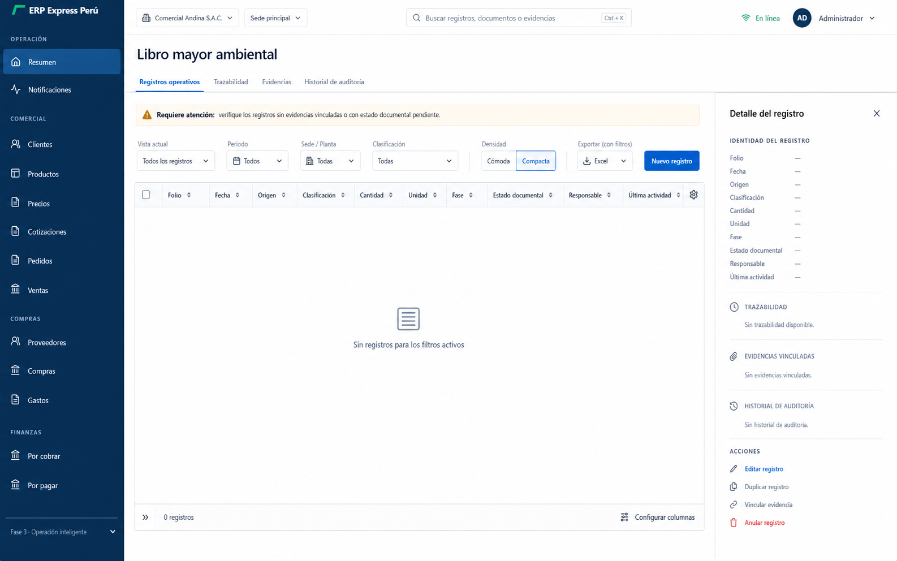
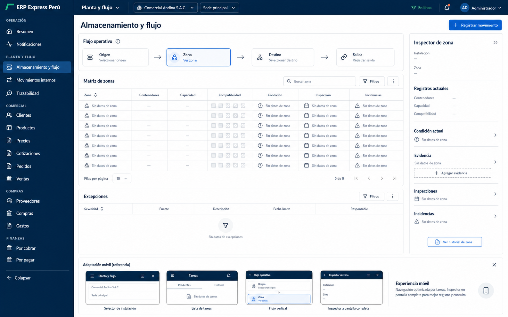

# Dirección visual

## Estado y alcance

Este documento define la propuesta visual previa a implementación para la
modernización del producto orientada a registro, segregación, almacenamiento,
trazabilidad y destino final de residuos.

Las imágenes de `docs/design-system/concepts/` son especificaciones
conceptuales. Emplean placeholders, estados vacíos y roles estructurales para
explicar jerarquía, composición e interacción. No constituyen evidencia de que
una función exista, de que un flujo esté conectado extremo a extremo ni de que
los datos visibles provengan del sistema.

No se deben convertir los siguientes elementos conceptuales en afirmaciones:

- nombres de módulos o rutas aún no implementados;
- conteos, cantidades, capacidades, fechas, responsables o vencimientos;
- categorías, colores de contenedor o clasificaciones de residuos;
- obligaciones, artículos, vigencias o estados de cumplimiento;
- operadores, autorizaciones, destinos o documentos;
- controles que todavía no cuenten con comportamiento, permiso y API.

La implementación deberá preservar el shell, la identidad del producto, los
permisos, las rutas, los contratos y los componentes aprovechables descritos en
[Inventario y contrato de componentes](component-inventory.md). Los valores
visuales se rigen por [Tokens del sistema de diseño](tokens.md).

## Base visual auditada

La aplicación actual tiene una identidad reconocible y sobria:

- navegación azul marino;
- superficies blancas y fondos secundarios gris frío;
- azul para enlace, foco y selección;
- esmeralda para acción primaria y confirmación;
- ámbar y rojo para atención y peligro;
- bordes finos, radios moderados y sombras escasas;
- tipografía `Inter` cuando está disponible, con fallback de sistema;
- iconografía de `lucide-react`.

Esta base se conserva. La modernización no depende de otra marca, gradientes,
glassmorphism, ilustraciones genéricas ni de colorear toda la interfaz de verde.
La diferencia debe provenir de la relación visible entre actividad, fase,
responsable, evidencia, excepción y cierre.

### Deuda que la nueva dirección debe resolver

- Existe una paleta global y otra paleta local `p3-*`; ambas deben converger en
  tokens semánticos.
- El dashboard actual se apoya en un rail repetitivo de indicadores y paneles.
  Ese patrón no será la entrada principal del espacio de residuos.
- La navegación de escritorio no se colapsa y puede crecer demasiado.
- Las tablas generales y de Fase 3, los encabezados, tabs, inputs y avisos tienen
  implementaciones duplicadas.
- En móvil, algunas pantallas apilan paneles muy altos o trasladan tabs
  horizontales sin redefinir la tarea.
- Un `ResourcePanel` que descubre columnas desde el payload no ofrece el control
  de lenguaje, sensibilidad ni prioridad requerido por un dominio auditable.

## Principios de dirección

1. La primera superficie muestra trabajo pendiente y decisiones, no métricas
   aisladas.
2. El ciclo de vida es una relación navegable entre fases, registros y
   evidencias, no una ilustración decorativa.
3. La trazabilidad se presenta como una secuencia única y reconstruible.
4. La tabla se usa para comparar y operar sobre registros; no para representar
   por sí sola todo el producto.
5. El inspector contextual evita perder el contexto al consultar detalle.
6. La interfaz admite densidad `comfortable` y `compact` donde corresponda.
7. El color acompaña texto, icono, forma o patrón; nunca comunica solo.
8. Los colores de categorías de residuos quedan reservados al dominio y se
   activan únicamente con catálogo y fuente verificados.
9. Cada acción visible debe tener comportamiento, permiso y resultado real.
10. Móvil se organiza por tareas de campo y no como una reducción del
    escritorio.

## Comparación de direcciones

| Criterio | A. Cadena de custodia operativa | B. Libro mayor ambiental | C. Planta y flujo |
|---|---:|---:|---:|
| Claridad operativa | 10 | 9 | 8 |
| Distinción visual | 9 | 7 | 10 |
| Usabilidad | 9 | 10 | 8 |
| Accesibilidad | 9 | 10 | 8 |
| Factibilidad de implementación | 9 | 10 | 7 |
| Rendimiento | 9 | 10 | 7 |
| Escalabilidad | 9 | 9 | 8 |
| Coherencia con el propósito | 10 | 8 | 10 |
| **Total** | **74/80** | **73/80** | **66/80** |

Los puntajes evalúan el concepto visual y su adecuación al alcance, no la
madurez funcional actual.

## Dirección A - Cadena de custodia operativa

### Concepto

Un espacio de trabajo que conecta atención inmediata, ciclo de vida, registros
vinculados e inspector de fase. La unidad visual principal no es una tarjeta ni
una métrica: es la relación entre una actividad pendiente y el punto exacto de
la cadena donde debe resolverse.

### Shell

- Sidebar persistente y colapsable en escritorio.
- Navegación agrupada por propósito, filtrada por permiso y módulo.
- Topbar compacta con empresa, sede, periodo, búsqueda o comando y usuario.
- Contexto activo siempre visible antes de ejecutar una acción.
- Centro de excepciones accesible sin llenar el topbar de funciones.
- En móvil, drawer táctil y navegación orientada a las tareas permitidas.

La búsqueda global y el comando `Ctrl+K` solo se muestran como controles
funcionales cuando exista un índice real, permisos aplicados y navegación
conectada.

### Espacio principal

El escritorio se organiza en:

1. cola `Requiere atención`;
2. rail del ciclo de vida;
3. registros vinculados;
4. inspector contextual de la fase o registro seleccionado.

La selección en una región actualiza las demás sin perder el contexto. Una fase
filtra los registros vinculados; una fila abre el detalle; una evidencia o
incidencia conduce al registro que la origina.

### Pantalla de registros

- Tabla densa con encabezado persistente.
- Columnas explícitas, nunca inferidas automáticamente del payload.
- Filtros activos visibles y removibles.
- Filas expandibles para resumen de evidencia, excepciones o últimas acciones.
- Columnas configurables, fijables y operaciones masivas solo cuando exista un
  caso de uso y soporte real.
- Estado vacío que diferencia ausencia de datos, filtros sin resultados y falta
  de permiso.

### Pantalla de detalle

- Identidad y estado del registro al inicio.
- Timeline única para generación, movimientos, almacenamiento, despacho,
  destino y cierre.
- Evidencia, incidencias y base legal o procedimental junto al evento al que
  pertenecen.
- Historial de cambios y versiones como información auditable, no como panel
  decorativo.
- Acciones contextuales limitadas al estado, rol y permiso vigentes.

### Formulario

- Captura enfocada y guiada por contexto.
- Clasificación, ubicación, cantidad, responsable y evidencia se presentan solo
  si el contrato real del flujo los requiere.
- Ayuda legal o procedimental junto a la decisión correspondiente.
- Validación inline y resumen de errores persistente.
- Borrador, autosave y recuperación solo cuando la arquitectura pueda garantizar
  ámbito de usuario y empresa, reconciliación y protección de datos.
- Un flujo largo expone pasos, bloqueos y retorno sin pérdida; uno corto no se
  convierte artificialmente en wizard.

### Estado de excepción

La excepción es una cola operativa master-detail. Cada elemento debe exponer,
cuando los datos existan:

- severidad;
- fuente;
- evidencia;
- responsable;
- plazo;
- acción inmediata;
- acción correctiva;
- estado;
- verificación de cierre.

El cierre no se representa como correcto por el color. Debe mostrar etiqueta,
icono y evidencia o verificación exigida por la regla real.

### Adaptación móvil

- La cola de tareas precede al panorama general.
- El rail horizontal se transforma en una lista vertical de fases.
- El inspector se abre en pantalla completa o bottom sheet.
- Los registros se convierten en listas orientadas a tarea, no en tablas
  comprimidas.
- Filtros y búsqueda se conservan.
- Las acciones principales permanecen al alcance del pulgar.
- La captura de cámara, QR u offline no se representa hasta estar implementada,
  autorizada y probada extremo a extremo.

### Tipografía, color y superficies

- Sans serif de producto para navegación, controles y lectura prolongada.
- Números, folios y cantidades con cifras tabulares.
- Títulos compactos; no hay hero interno.
- Azul marino para estructura y contexto.
- Azul para selección, navegación contextual y foco.
- Esmeralda para acción primaria o éxito confirmado, no para toda la temática.
- Ámbar y rojo únicamente para estados semánticos.
- Colores de categorías de residuos limitados a marcadores, muestras o
  referencias respaldadas.
- Superficie base blanca, divisores finos y sombra solo en overlays.

### Interacción y movimiento

- Selección sincronizada entre cola, fase, registros e inspector.
- Focus visible y orden lógico en todas las regiones.
- Atajos anunciados y configurables, sin reemplazar navegación convencional.
- Transiciones breves para mostrar continuidad al abrir inspector o cambiar de
  fase.
- `prefers-reduced-motion` elimina desplazamiento y conserva feedback inmediato.

## Dirección B - Libro mayor ambiental

### Concepto

Una superficie editorial y tabular para usuarios expertos, auditoría y grandes
volúmenes. La tabla es la fuente primaria de comparación y el inspector reúne
identidad, trazabilidad, evidencia, historial y acciones.

### Shell y espacio principal

- Conserva el shell existente con ajustes de densidad.
- La búsqueda global ocupa el centro de la topbar.
- Tabs de primer nivel separan registros, trazabilidad, evidencias e historial.
- Una franja breve comunica atención requerida.
- Filtros, densidad, exportación y alta de registro se agrupan en una barra
  operativa.

### Registros, detalle, formulario y excepción

- Tabla con sorting, selección, columnas configurables y encabezado sticky.
- Split view persistente para el detalle.
- Trazabilidad y evidencia como secciones del mismo registro.
- Formularios en drawer o vista dedicada según longitud.
- Excepciones integradas al ledger mediante filtro, estado y bandeja priorizada.
- Exportar con filtros, duplicar o anular solo se muestran si las funciones
  existen y aplican al registro.

### Adaptación móvil

- Lista de registros por tarea con campos prioritarios.
- Filtros en sheet.
- Detalle y formulario a pantalla completa.
- Timeline vertical y acciones seguras en barra inferior.

### Lenguaje visual

- Mayor densidad, color mínimo y jerarquía tipográfica editorial.
- Numerales tabulares y divisores dominantes.
- Excelente para auditoría y comparación, pero menos inmediato para usuarios
  ocasionales y menos expresivo del ciclo completo.

## Dirección C - Planta y flujo

### Concepto

Una vista técnica de origen, zona, destino y salida, apoyada por una matriz de
zonas e inspector. Hace visible la relación espacial y operativa sin inventar un
mapa físico.

### Shell y espacio principal

- El contexto `Planta y flujo` se integra a la topbar.
- Un flow rail de cuatro puntos guía la selección.
- La matriz de zonas muestra capacidad, compatibilidad, condición, inspección e
  incidencias solo si esos campos existen.
- El inspector mantiene contexto de instalación y zona.
- La cola de excepciones permanece debajo de la matriz.

### Registros, detalle, formulario y excepción

- La matriz es el índice primario.
- El detalle bifocal relaciona zona, registros actuales, evidencia, inspecciones
  e incidencias.
- El formulario parte del contexto seleccionado para evitar repetición.
- Los movimientos se representan como relaciones de origen y destino.
- Las excepciones se vinculan a su zona y evento de origen.

### Adaptación móvil

- Selector de instalación y zona.
- Lista de tareas.
- Flujo vertical.
- Inspector a pantalla completa.

### Lenguaje visual y límite

- Retícula técnica, iconografía material y patrones además del color.
- Alta distinción y buena adecuación al almacenamiento.
- No debe convertirse en plano o mapa cuando no exista geometría válida.
- Depende de relaciones de zona, capacidad y compatibilidad que aún deben
  verificarse; por eso tiene menor factibilidad y rendimiento previsto.

## Dirección seleccionada

Se selecciona **Dirección A - Cadena de custodia operativa**.

Es la alternativa que mejor responde simultáneamente:

- qué requiere atención;
- en qué fase está cada actividad;
- qué registros están vinculados;
- qué evidencia falta;
- quién debe actuar;
- cómo se reconstruye la trazabilidad;
- qué excepción impide el cierre.

La selección no autoriza mezclar las tres estéticas. De la dirección B se puede
reutilizar la anatomía de tabla e inspector como componente subordinado. De la
dirección C se puede reutilizar una matriz estructurada para almacenamiento
cuando existan datos de zona. El shell, la jerarquía y el modelo de interacción
permanecen en A.

## Reglas de copy y datos

1. Todo contenido visible se redacta en español formal y claro.
2. Los nombres de estados se definen en el módulo y se mapean desde valores
   reales de API.
3. Un placeholder conceptual se reemplaza por un estado vacío explícito; nunca
   por datos inventados.
4. No se inventan residuos, categorías, colores, cantidades, unidades,
   instalaciones, responsables, operadores, destinos ni documentos.
5. No se afirma cumplimiento, peligrosidad, recuperabilidad, autorización o
   vigencia sin fuente autoritativa.
6. Las citas legales conservan texto, fuente oficial y fecha de consulta
   verificadas.
7. Un botón, filtro, búsqueda, exportación, cámara, QR, mapa o notificación solo
   se muestra como control final cuando funciona y puede probarse.
8. `Sin datos disponibles`, `Sin resultados para los filtros` y `No tiene
   permiso para ver esta información` son estados distintos.
9. El copy de error explica qué ocurrió, qué se conservó y cuál es el siguiente
   paso seguro.
10. Ninguna imagen conceptual se usa como evidencia de producción, cumplimiento
    o comportamiento ejecutado.

## Criterios para pasar a implementación

- confirmar inventario real de rutas, entidades, APIs, permisos y estados;
- aprobar la dirección A como objetivo visual;
- definir el vertical slice funcional y sus datos reales;
- mapear los componentes requeridos al inventario;
- validar tokens finales y contraste;
- definir estados vacíos, carga, error, bloqueo, offline y permiso denegado;
- establecer capturas de referencia para desktop y móvil;
- implementar y verificar una fase completa antes de escalar.
